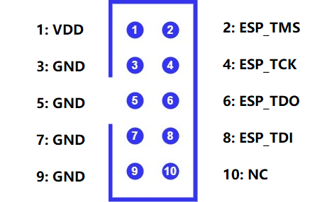

## Setup ESP-PROG and ESP32 device Guide

The following hardware is required for this project:
- ESP32-WROOM-32 development board
- ESP-PROG programmer
- USB cable(s)
- Six male-to-female jumper wires
- USB Hub: Helpful for connecting both the ESP32 and ESP-PROG if your computer has limited ports.

### ESP-PROG connection

ESP-PROG contains a 10-pin header which allows wiring to the JTAG interface. For reference, each pin on the header is numbered in the figure below: 

To wire the ESP32 to the ESP-PROG, use the table below as a guide.
Note that four of the pins on the headers will go unused.

Note: ESP-PROG supports both 3.3V and 5V. We assume the pin header is set to use the voltage level of 3.3V. If needed, follow [guide](https://docs.espressif.com/projects/espressif-esp-iot-solution/en/latest/hw-reference/ESP-Prog_guide.html#pin-headers) to select 3.3V for the JTAG interface. **JTAG will not work if 5V is selected** unless you swap ESP-PROG's VDD pin to the 5V pin of ESP32.

To connect the devices to your host computer, you can connect the ESP-PROG to the computer directly via a USB cable. You do **not** need to connect the ESP32 to your computer directly. It will receive power from the ESP-PROG via the VDD pin. The JTAG interface also enables programming capabilities for uploading the application to the ESP32, so there is no need to connect to the UART controller on the development board.

### Links:

[Introduction to the ESP-Prog Board](https://docs.espressif.com/projects/esp-iot-solution/en/latest/hw-reference/ESP-Prog_guide.html) Espressif documentations

[ESP32-With-ESP-PROG-Demo](https://github.com/PBearson/ESP32-With-ESP-PROG-Demo) github project

[Zadig](https://zadig.akeo.ie/) USB driver installation

